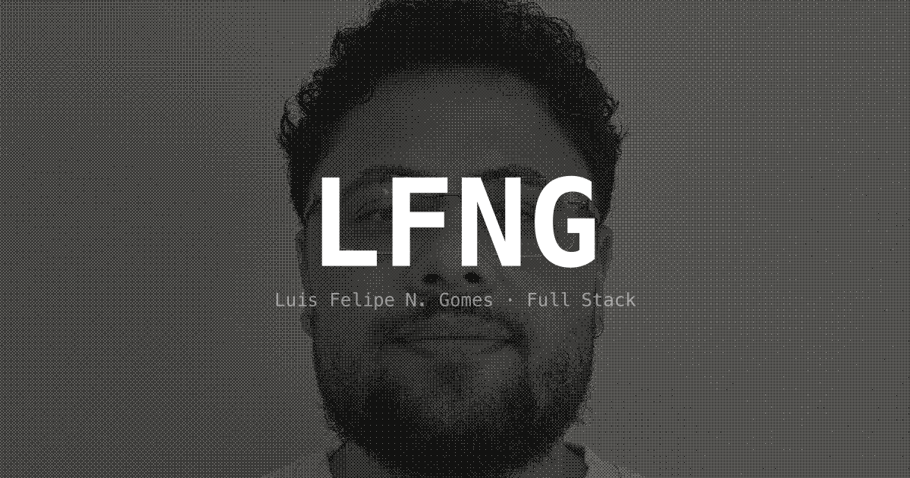

# lfng.dev

Personal portfolio and online CV built with Next.js 16, Tailwind CSS 4, and server-side internationalization.

**Live:** [lfng.dev](https://lfng.dev)



## Features

- **Bilingual** — Full PT-BR and English support via `next-intl` with SSG and locale-based routing
- **Dynamic CV** — Downloadable PDF generated on-the-fly with `@react-pdf/renderer`, cached for 24h
- **Halftone Shader** — Canvas-based ordered dithering (8x8 Bayer matrix) that transforms a photo into a black & white halftone effect
- **Decrypt Intro** — Character-scramble animation on first visit (faster on revisits), respects `prefers-reduced-motion`
- **Three-column editorial layout** — Inspired by [dany.page](https://dany.page) — sidebar, experience timeline, and skills panel
- **OG image** — Auto-generated with halftone background
- **Accessible** — Skip-to-content link, ARIA labels, semantic HTML, focus management

## Tech Stack

| Layer | Tools |
|---|---|
| Framework | Next.js 16 (App Router, Turbopack) |
| Language | TypeScript 5.9 |
| UI | React 19, Radix UI, shadcn/ui |
| Styling | Tailwind CSS 4, CVA, OKLCH design tokens |
| i18n | next-intl 4 (server-side) |
| PDF | @react-pdf/renderer |
| Icons | Nucleo (Social Media, Isometric, Arcade) |
| Analytics | Vercel Analytics |
| Deploy | Vercel |

## Design System

**Typography** — Geist Mono for headings, JetBrains Mono for body. Monospace-only aesthetic.

**Colors** — Neutral OKLCH palette with light/dark mode via CSS custom properties. No accent hue — the design relies on contrast, spacing, and the halftone photo for visual interest.

**Tokens** — All colors, radii, and semantic values defined as CSS variables in `globals.css` following the shadcn/ui convention.

## Project Structure

```
src/
├── app/[locale]/
│   ├── components/       # UI components (sidebar, experience, skills, halftone, intro)
│   ├── api/cv/           # Dynamic PDF CV generation endpoint
│   ├── data/             # Portfolio data (jobs, projects)
│   ├── layout.tsx        # Root layout (fonts, metadata, i18n)
│   ├── page.tsx          # Home page (3-column grid)
│   └── globals.css       # Design tokens & global styles
├── hooks/                # Custom hooks (decrypt animation, mount effect)
├── i18n/                 # Locale config, routing, navigation helpers
├── messages/             # Translation files (pt-BR.json, en.json)
└── lib/                  # Constants (contact info, skills, timing)
```

## Getting Started

```bash
# Prerequisites: Node.js 22+
nvm use

# Install dependencies
npm install

# Start dev server
npm run dev
```

Open [http://localhost:3000](http://localhost:3000).

## Scripts

| Command | Description |
|---|---|
| `npm run dev` | Start development server with Turbopack |
| `npm run build` | Production build |
| `npm run start` | Start production server |
| `npm run lint` | Run ESLint |

## License

MIT
